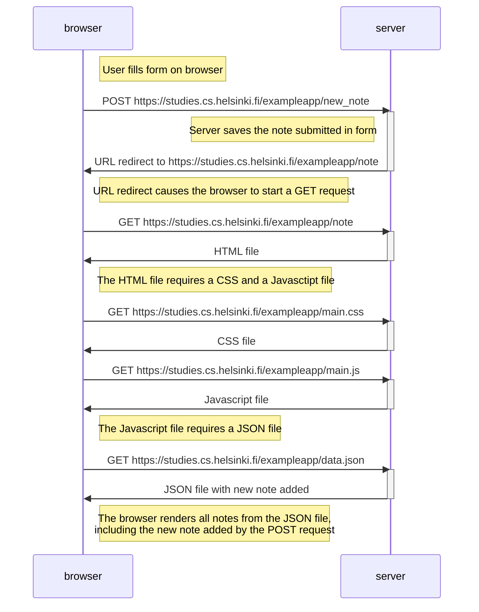

```mermaid
sequenceDiagram
    participant browser
    participant server

    Note right of browser: User fills form on browser
    browser->>server: POST https://studies.cs.helsinki.fi/exampleapp/new_note
    activate server
    Note left of server: Server saves the note submitted in form
    server->>browser: URL redirect to https://studies.cs.helsinki.fi/exampleapp/note
    deactivate server

    Note right of browser: URL redirect causes the browser to start a GET request

    browser->>server: GET https://studies.cs.helsinki.fi/exampleapp/note
    activate server
    server->>browser: HTML file
    deactivate server

    Note right of browser: The HTML file requires a CSS and a Javasctipt file

    browser->>server: GET https://studies.cs.helsinki.fi/exampleapp/main.css
    activate server
    server->>browser: CSS file
    deactivate server

    browser->>server: GET https://studies.cs.helsinki.fi/exampleapp/main.js
    activate server
    server->>browser: Javascript file
    deactivate server

    Note right of browser: The Javascript file requires a JSON file

    browser->>server: GET https://studies.cs.helsinki.fi/exampleapp/data.json
    activate server
    server->>browser: JSON file with new note added
    deactivate server

    Note right of browser: The browser renders all notes from the JSON file, <br/> including the new note added by the POST request
```