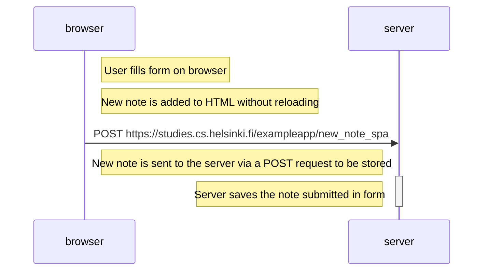

```mermaid
sequenceDiagram
    participant browser
    participant server

    Note right of browser: User fills form on browser
    Note right of browser: New note is added to HTML without reloading
    browser->>server: POST https://studies.cs.helsinki.fi/exampleapp/new_note_spa
    Note left of server: New note is sent to the server via a POST request to be stored
    activate server
    Note left of server: Server saves the note submitted in form
    deactivate server
```